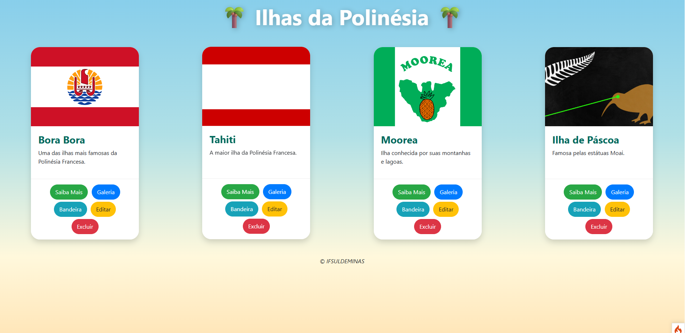

# 🌴 Ilhas da Polinésia

Sistema desenvolvido com CodeIgniter 4 para apresentar informações sobre algumas das principais ilhas da Polinésia.

## 📸 Demonstração do Sistema

<p align="center">
  
</p>

## 🏝️ Ilhas Apresentadas

- Bora Bora
- Tahiti
- Moorea
- Rapa Nui (Ilha de Páscoa)

## ⚙️ Funcionalidades

- Exibição de ilhas em cards
- Imagens ilustrativas
- Descrições resumidas
- Interface responsiva
- Integração com banco de dados MySQL

## 🛠️ Tecnologias Utilizadas

- PHP
- CodeIgniter 4
- MySQL
- Bootstrap 4
- HTML5
- CSS3

## 🚀 Como Executar

1. Clone o repositório
2. Configure o banco de dados MySQL
3. Ajuste o arquivo `app/Config/Database.php`
4. Inicie Apache e MySQL no XAMPP
5. Acesse:

```text
http://localhost/polinesia/public
